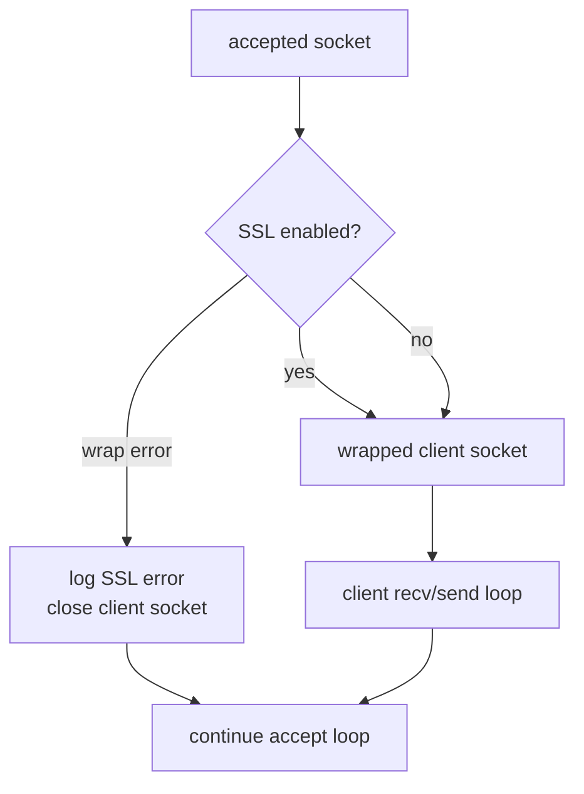
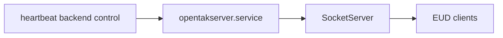

# EUD TLS Accept Runtime

This document covers the `OpenTAKServer` EUD socket runtime change:

- `opentakserver/__init__.py`
- `opentakserver/eud_handler/SocketServer.py`

The version file change is metadata only. The real runtime change is in the EUD socket server.

## 1. Listener Ownership Model

### Before / After Intent
- The listener is still the same EUD ingress point.
- The important architectural change is where TLS wrapping happens.

### Current Model

```mermaid
flowchart LR
  Client[EUD client] --> LS[plain listening socket]
  LS --> Accept[accept()]
  Accept --> Wrap[per-client SSL wrap when configured]
  Wrap --> Handler[client handler loop]
  Handler --> App[EUD / server pipeline]
```

### Why This Matters
- The listening socket stays simple.
- SSL handshake failures are localized to the accepted client connection instead of contaminating the entire listening socket state.
- Backlog is now large enough for burstier client arrival patterns.

## 2. Error Isolation And Backlog Behavior



## 3. Cross-Repo Interaction

This change matters to `heartbeat` because the SWM field-computer surface treats OpenTAK as a native service plane with stricter health and trust semantics.



## 4. Scope Notes
- `opentakserver/__init__.py` is a version bump only.
- The changed runtime surface is the SSL wrapping point, backlog handling, and accept-loop resilience.
